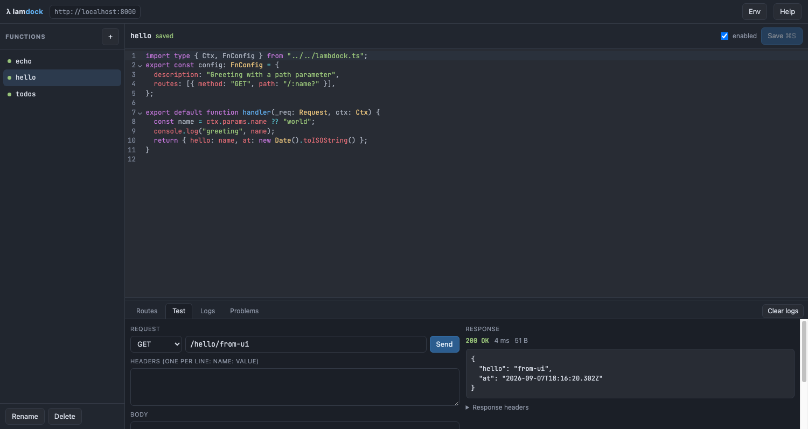

# lambdock

Self-hosted TypeScript functions on [Deno](https://deno.com), with a web editor.

Write a function in the browser or from your own machine. A save makes a draft. Tests run against
that draft, and a version makes it live. Every function gets its own sub-route below one host and
one port. The files stay on disk, so a reboot does not remove them.



## What you get

|                        |                                                                                        |
| ---------------------- | -------------------------------------------------------------------------------------- |
| **One host, one port** | Every function is mounted below `/<name>`. Routes cannot collide.                      |
| **Path parameters**    | The standard `:param`, `:param?` and `*` format, from the built-in `URLPattern`.       |
| **Interactive editor** | CodeMirror with TypeScript highlighting, a request tester, live logs and `deno check`. |
| **Draft and versions** | A save cannot break a live route. `deno check` and your tests gate each new version.   |
| **Tests on the draft** | `handler.test.ts` runs against what you saved, before it can go live.                  |
| **Command line**       | `@lambdock/client` pushes, tests, publishes and rolls back from your own machine.      |
| **Reboot-safe**        | Source, settings and function data live in one directory. Mount it as a volume.        |
| **Hot reload**         | A new version reloads only that function. The server does not restart.                 |
| **Container-ready**    | A multi-architecture image is on the GitHub container registry.                        |

## Quick start

### With podman (recommended for a server)

```bash
mkdir -p ~/lambdock && cd ~/lambdock
curl -O https://raw.githubusercontent.com/jotoh98/lambdock/main/compose.yaml
podman-compose up -d
```

Open <http://localhost:8000/__/>.

See [docs/deploy-podman.md](docs/deploy-podman.md) for auto-start, updates and backups.

### With docker

```bash
mkdir -p ~/lambdock && cd ~/lambdock
curl -O https://raw.githubusercontent.com/jotoh98/lambdock/main/compose.docker.yaml
docker compose -f compose.docker.yaml up -d
```

The image is public. No `docker login` is necessary.

On Linux the container writes the files in `./data` as root. Remove the comment marks on the `user:`
line in the file to get your own ids. Docker Desktop on macOS and Windows does this for you.

### From source

```bash
git clone https://github.com/jotoh98/lambdock.git
cd lambdock
deno task dev
```

Deno 2.4 or later is necessary.

The first start writes three example functions into `./data`.

## How the URLs work

The first path segment selects the function. The rest goes to the routes of that function.

```
http://localhost:8000/hello/ada
                     └───┘ └─┘
                     name  path inside the function
```

| Path          | Goes to                       |
| ------------- | ----------------------------- |
| `/__/`        | the editor                    |
| `/__/api/...` | the admin API                 |
| `/hello`      | function `hello`, path `/`    |
| `/hello/ada`  | function `hello`, path `/ada` |
| `/todos/42`   | function `todos`, path `/42`  |

A function name must start with a letter or a digit. The editor uses the prefix `__`. Therefore a
function can never take the URL of the editor, and two functions can never take the same URL.

## Draft, tests, version

A save never changes what the server answers with.

```
   save              test                     publish              rollback
draft ────► draft ────────► deno check ────► version 3 ────► live   version 2 ────► live
            (on disk)       + handler.test.ts   (immutable)
```

| Step         | What happens                                                                     |
| ------------ | -------------------------------------------------------------------------------- |
| **Save**     | Writes `handler.ts`. The live route keeps serving the version it had.            |
| **Test**     | Runs `handler.test.ts` against the draft on disk, in a subprocess.               |
| **Publish**  | Runs the type check and the tests. Both must pass, then a new version goes live. |
| **Rollback** | Points the live route at a version that already exists. No new code is needed.   |

A new function is an exception: it has nothing live to break, so version 1 goes live at once. Every
later save is a draft.

A version is an immutable copy. An old version keeps its own source and its own tests, so a rollback
gives you exactly the code that ran before.

Publish with a failing gate only with `force`. The version then records `tests: "forced"`, so the
history says how it got there.

A function with no version answers `409 no_live_version` and names the fix.

## Write a function

```ts
import type { Ctx, FnConfig } from "../../lambdock.ts";

export const config: FnConfig = {
  description: "Shows one user",
  routes: [
    { method: "GET", path: "/" },
    { method: "GET", path: "/:id" },
    { method: "POST", path: "/:id/avatar" },
  ],
  timeoutMs: 30000,
};

export default async function handler(req: Request, ctx: Ctx) {
  ctx.params.id; // path parameter
  ctx.url.searchParams.get("q"); // query string
  ctx.env.API_KEY; // shared environment store
  await ctx.kv.set("last", Date.now()); // storage that stays after a reboot
  console.log("hello"); // shows in the Logs tab

  return { id: ctx.params.id }; // an object becomes JSON
}
```

If you give no `config`, the function receives every method on every sub-path.

**Write the tests next to it** in `handler.test.ts`:

```ts
import { assertEquals } from "jsr:@std/assert@^1.0.10";
import { callFn } from "../../lambdock.ts";
import handler from "./handler.ts";

Deno.test("one user comes back", async () => {
  const res = await callFn(handler, "/42", { params: { id: "42" } });
  assertEquals(res.status, 200);
  assertEquals((await res.json()).id, "42");
});
```

`callFn` calls the handler the way the server does and always gives you a `Response`. The context it
builds has an in-memory `ctx.kv`, so a test never touches stored data.

**Return values**

| You return        | The client gets          |
| ----------------- | ------------------------ |
| `Response`        | that response, unchanged |
| `string`          | 200, `text/plain`        |
| `null` or nothing | 204                      |
| anything else     | 200, `application/json`  |

More detail: [docs/writing-functions.md](docs/writing-functions.md).

## Path parameters

Patterns use the [`URLPattern`](https://developer.mozilla.org/docs/Web/API/URLPattern) syntax, the
same format as Express and many routers.

| Pattern                   | Matches          | `ctx.params`              |
| ------------------------- | ---------------- | ------------------------- |
| `/:id`                    | `/42`            | `{ id: "42" }`            |
| `/:name?`                 | `/` and `/ada`   | `{}` or `{ name: "ada" }` |
| `/users/:id/posts/:post?` | `/users/7/posts` | `{ id: "7" }`             |
| `/files/*`                | `/files/a/b.txt` | `{ "0": "a/b.txt" }`      |

Routes are tried in the order of the `routes` array. The first match wins.

## The editor

Open `/__/` .

- **Routes** — the live URLs of the function. Each one is a link.
- **Try** — send a request with a method, a path, headers and a body.
- **Tests** — run `handler.test.ts` against the saved draft and read the output.
- **Versions** — the history, which version is live, and a **Make live** button for each.
- **Logs** — `console.log` and request lines, streamed live.
- **Problems** — the output of `deno check` and module load errors.
- **Env** — shared variables, available as `ctx.env`.

The pill next to the name says what answers a request: `live v3`, `live v3 · draft ahead`, or
`no version`. The two buttons above the editor switch between `handler.ts` and `handler.test.ts`.

`Cmd`/`Ctrl` + `S` saves the draft. `Cmd`/`Ctrl` + `Enter` publishes it.

You can also edit the files with your own editor. The server sees the change and reloads the
function.

## Data on disk

```
data/
├── functions/
│   ├── hello/
│   │   ├── handler.ts        the draft
│   │   ├── handler.test.ts   the tests of the draft
│   │   └── meta.json         name, enabled, liveVersion, version history
│   ├── hello@1/              version 1, immutable
│   │   ├── handler.ts
│   │   └── handler.test.ts
│   └── hello@2/              version 2, immutable
│       └── handler.ts
├── env.json                  shared environment variables
├── kv.sqlite                 ctx.kv data of all functions
└── lambdock.ts               the type contract (written at each start)
```

A version lives in a sibling directory, at the same depth as the draft, so `../../lambdock.ts`
resolves the same way in both. `@` is not a legal function name, so a snapshot can never become a
function or take a URL.

Copy this directory to make a backup. Writes go through a temporary file and a rename, so a crash
cannot leave a half-written file.

## Compose files

| File                  | Use                                                        |
| --------------------- | ---------------------------------------------------------- |
| `compose.yaml`        | podman, pulls the published image (adds the SELinux label) |
| `compose.docker.yaml` | docker, pulls the published image                          |
| `compose.dev.yaml`    | builds the image from this checkout                        |

All three mount `./data`, so your functions survive a reboot and an image update.

## Configuration

| Variable                   | Default   | Function                                      |
| -------------------------- | --------- | --------------------------------------------- |
| `LAMBDOCK_DATA`            | `./data`  | Directory for functions and data              |
| `LAMBDOCK_HOST`            | `0.0.0.0` | Listen address                                |
| `LAMBDOCK_PORT`            | `8000`    | Listen port                                   |
| `LAMBDOCK_TIMEOUT_MS`      | `30000`   | Default timeout of a function                 |
| `LAMBDOCK_LOG_BUFFER`      | `300`     | Log lines kept per function                   |
| `LAMBDOCK_TYPECHECK`       | `1`       | Set to `0` to switch off `deno check`         |
| `LAMBDOCK_TESTS`           | `1`       | Set to `0` to skip the tests before a version |
| `LAMBDOCK_TEST_TIMEOUT_MS` | `60000`   | Time a test run may take                      |

## Tasks

```bash
deno task dev            # start, and restart when the server code changes
deno task start          # start
deno task test           # unit tests of the server
deno task test:client    # the client against a server in a subprocess
deno task test:e2e       # the image, in a real container (needs docker or podman)
deno task test:all       # all three
deno task check          # type check
deno task lint           # lint
deno task fmt            # format
deno task build:editor   # rebuild ui/vendor/editor.js
```

## From your own machine

`client/` is a Deno package that drives the admin API. It has no runtime dependency, so it compiles
into one binary that needs nothing on the machine that runs it:

```bash
cd client
deno task compile                  # dist/lambdock
deno run -A scripts/build.ts --all # or a binary per target
export LAMBDOCK_URL=http://192.168.2.93:8000
```

With Deno on the machine, `deno task install` puts `lambdock` on your PATH instead.

```bash
lambdock ls                        # every function and the version that is live
lambdock pull hello                # write the draft to hello/handler.ts
lambdock push hello                # save the draft, the live route does not move
lambdock test hello                # run the tests against the saved draft
lambdock invoke hello /ada         # run the draft and print the response
lambdock publish hello --note wip  # gate, then make it live
lambdock deploy hello              # push and publish in one step
lambdock versions hello
lambdock rollback hello 2
lambdock logs hello --follow
```

Or use it as a library:

```ts
import { Lambdock } from "@lambdock/client";

const lam = new Lambdock({ url: "http://192.168.2.93:8000" });
await lam.save("hello", { source: await Deno.readTextFile("handler.ts") });
const run = await lam.test("hello");
if (run.ok) await lam.publish("hello", { note: "greeting in German" });
```

See [client/README.md](client/README.md).

## Limits

Read these before you put lambdock on a public network.

- **There is no authentication.** Anybody who can open the port can change your code. Keep lambdock
  on a private network, or put a proxy with a password in front of it.
- **Functions are not isolated from each other.** They run in the server process and share its
  permissions. Run only code that you trust.
- **A timeout ends the response, not the code.** An endless loop continues until you restart the
  server.
- **Each version keeps the old module in memory.** This is a property of the Deno module cache.
  Restart the server after very many versions.
- **Versions protect the route, not the data.** A rollback gives you the old code. It does not give
  you the old `ctx.kv` content.
- **The tests run with full permissions.** They are a `deno test` subprocess, so the permissions of
  the server do not limit them. Run only tests that you trust.

See [docs/architecture.md](docs/architecture.md) for the reasons behind these.

## License

MIT
